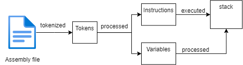

# Virtual machine in Rust<!-- omit in toc -->

This repository will cover what Rust is and how to create a stack based virtual machine.

- [What is a virtual machine](#what-is-a-virtual-machine)
- [What are VMs used for](#what-are-vms-used-for)
- [What is Rust](#what-is-rust)
- [Current usage of Rust](#current-usage-of-rust)
- [Getting started](#getting-started)
  - [Prerequisites](#prerequisites)
  - [Installing Rust](#installing-rust)
  - [Choosing an IDE](#choosing-an-ide)
- [Rust basics](#rust-basics)
  - [Hello world program](#hello-world-program)
  - [Variables](#variables)
  - [Mutability](#mutability)
  - [Functions in rust](#functions-in-rust)
  - [Flow of control](#flow-of-control)
  - [Custom types](#custom-types)
- [The virtual machine](#the-virtual-machine)
  - [Program structure](#program-structure)
  - [How the assembly code is processed](#how-the-assembly-code-is-processed)
- [Future reading](#future-reading)

## What is a virtual machine

A virtual machine (VM) is a virtual environment that functions as a virtual computer system with its own CPU, memory, network interface, and storage, created on a physical hardware system.
Two types:

- System virtual machines: they can replace a real machine by running entire operating systems
- Process virtual machines: allows a single process to run as an application on the host machine

This project will focus on the process virtual machines.

## What are VMs used for

These are some of the use cases where VMs are being actively used:

- Testing software on various platforms and operating systems without needing a second device.

- Testing virus infected software.

- Hosting multiple workstations on a powerful server for easier management.

- Building and deploying apps to the cloud.

- Game emulation(QEMU, DOLPHIN EMULATOR, RPCS3).

## What is Rust


Rust is a high-performance, statically-typed multi-paradigm programming language with the main focus on safety and performance.

It has extensive and useful documentation: an integrated package manager, multi-editor support with type inspections and auto-completion.

## Current usage of Rust

These are some domains where rust is actively being used:

- Building command line tools => [their own book on this subject](https://rust-cli.github.io/book/index.html)
- WebAssembly => [their own book on this subject](https://rustwasm.github.io/docs/book/)
- Networking
- Embedded software => [their own book on this subject](https://doc.rust-lang.org/stable/embedded-book/)

And some companies that use Rust in their products:

- Cloudflare
- Mozilla
- Dropbox
- Deliveroo
- Npm
- 1Password

And a lot more. The complete list can be found [here](https://www.rust-lang.org/production/users).

## Getting started

### Prerequisites

For this project I chose to work inside Windows 11 using WSL but any major operating system will work just fine. I will focus on WSL but for anyone out there looking to try this on a different op system I have linked the [Rustup](http://rust-lang.github.io/rustup/installation/index.html) book or the [Rust website](https://www.rust-lang.org/tools/install) which tells you the fastest way to install it on your system.

### Installing Rust

To quickly way to install Rust in WSL is to open up a terminal and run the following command

```bash
curl --proto '=https' --tlsv1.2 -sSf https://sh.rustup.rs | sh
```

You will be prompted to choose the installation type: either the default one(which I recommend) or the customized one.

Now to verify this was installed, and it's ready to be used run the following command:

```bash
rustc -V
```

The output should look similar to this one but probably with a newer version:

```bash
rustc 1.66.0 (69f9c33d7 2022-12-12)
```

### Choosing an IDE

Now it's time to choose an IDE either a Jetbrains product or Visual Studio Code will work.
For Visual Studio Code there is this [tutorial](https://www.geeksforgeeks.org/how-to-setup-rust-in-vscode/) that can get you up and running in no time.
For Jetbrains either [Clion](https://www.jetbrains.com/clion/) or [IntelliJ IDEA](https://www.jetbrains.com/idea/) supports their [Rust plugin](https://www.jetbrains.com/rust/) which is what I used when developing the project. You can read all about it if you click on the embedded link.

## Rust basics

Depending on your learning style there are multiple ways to [learn Rust](https://www.rust-lang.org/learn) which are provided for free by the Rust team. The one I ended up following was [Rust by example](https://doc.rust-lang.org/stable/rust-by-example/hello.html).

### Hello world program

This is what a Hello World program looks like in Rust:

```rust
fn main() {
    // Statements here are executed when the compiled binary is called

    // Print text to the console
    println!("Hello World!");
}
```

### Variables

Variable types can be either auto inferred from the context or type annotated:

```rust
#![allow(unused_variables)]
fn main() {
    //Type annotated:
    let logical:bool = true;
    //Auto inferred:
    let logical = true;
}
```

### Mutability

Another important aspect of rust is that variables by default are [immutable](https://doc.rust-lang.org/stable/rust-by-example/variable_bindings/mut.html) meaning their value cannot change. To make them mutable we need to use ```mut``` keyword when defining a variable:

```rust
#![allow(unused_variables)]
fn main() {
    let immutable = 0;
    let mut mutable = 0;
}
```

### Functions in rust  

Following the same logic, to define a [function](https://doc.rust-lang.org/stable/rust-by-example/fn.html) we need to write:

```rust
#![allow(unused_variables)]
fn function_name(parameters_names: parameter_type)->return_type{
    //function logic
}
```

So a function has a name and parameters if there are any. To define their type we need to use the ```:``` syntax as shown above.

The return type can be any of the [primitive types](https://doc.rust-lang.org/stable/rust-by-example/primitives.html) or even a [collection type](https://doc.rust-lang.org/std/collections/index.html).

### Flow of control

To control the [flow of a program](https://doc.rust-lang.org/stable/rust-by-example/flow_control.html), rust provides its own methods:

- if/else => similar to other languages but the boolean condition doesn't need parentheses
- loop for infinite loops => loop which can be stopped with the ```break``` keyword
- while => same as in if no parentheses required
- for i in range => ```for n in 1..101``` example for the syntax n being the loop variable 1 starting value and 101 the end value
- for element in collection => example for the syntax ```for name in names``` name being a loop variable and names being a collection
- [match](https://doc.rust-lang.org/std/keyword.match.html) => same logic as a C switch

### Custom types

Rust supports 2 types of custom types: [structures](https://doc.rust-lang.org/stable/rust-by-example/custom_types/structs.html) and [enumerations](https://doc.rust-lang.org/stable/rust-by-example/custom_types/enum.html).

```rust
struct StructName {
    parameters : parameter_type // parameter type can be anything primitive or collections
}
```

```rust
enum WebEvent {
    // An `enum` may either be `unit-like`,
    PageLoad,
    PageUnload,
    // like tuple structs,
    KeyPress(char),
    Paste(String),
    // or c-like structures.
    Click { x: i64, y: i64 },
}
```

For custom types we can create [associated functions and methods](https://doc.rust-lang.org/stable/rust-by-example/fn/methods.html) using the ```impl``` keyword.

## The virtual machine

The complete code for the virtual machine can be found [here](https://github.com/0Unkn0wn/RustVM).

### Program structure

The code is split into multiple files. The main function initializes a variable wit the path of the file containing the assembly-like code and then calls the execute function of the vm structure. At the end the stack is printed to see the results of the instructions.

```rust
fn main() {

    let file_path = "assembly.txt";
    let mut vm = VM::new();
    vm.execute(file_path);
    vm.print_stack();
}
```

### How the assembly code is processed

The diagram below describes how the assembly file is being processed by the vm.



Firstly the text inside the assembly file is transformed into tokens through the use a function called ```tokenize_file``` which returns a vector of tokens at the end.

The enum Token:

```rust
pub enum Token{
    Operation(String),
    Comment(String),
    Label(String),
    Directive(String),
    Variable(String),
    End
}
```

```rust
pub fn tokenize_file(file_name: &str) -> VecDeque<Token> {
    let file = fs::read_to_string(file_name).expect("Unable to read file");
    let mut tokens = VecDeque::new();
    let mut lines = file.lines();
    let mut line = lines.next();
    while line.is_some() {
        // println!("Line: {:?}", line); //debug
        let text = line.unwrap().trim();
        // println!("Text: {:?}", text); //debug
        match text{
            "" => tokens.push_back(Token::End),
            _ => {
                if text.starts_with(";") {
                    tokens.push_back(Token::Comment(text.to_string()));
                } else if text.starts_with(".") {
                    tokens.push_back(Token::Directive(text.to_string()));
                } else if text.starts_with("#") {
                    tokens.push_back(Token::Label(text.to_string()));
                } else if text.starts_with("@") {
                    tokens.push_back(Token::Variable(text.to_string()));
                } else {
                    tokens.push_back(Token::Operation(text.to_string()));
                }
            }
        }
        line = lines.next();
    }
    tokens
}
```

After that we process each type of token separately depending on its type, and we return a tuple of 2 vectors: one for variables and one for instructions.

```rust
pub fn from_tokens(mut tokens: VecDeque<Token>) -> (Vec<Self>,Vec<String>) {
//a snippet of the function that processes tokens
  for token in tokens {
    match token {
      Token::Operation(s) => {
        Self::process_operation(s, &mut instructions);
      },
      Token::Label(s) => {
        match s.as_str() {
          "#data" => println!("Data section"),
          "#code" => println!("Main section"),
          _ => println!("Label: {}", s)
        }
      },
      Token::Variable(s) => {
        variables.push(s.to_string());
      },
      Token::Directive(s) => {
        let mut parts = s.split_whitespace();
        let name = parts.next().unwrap();
        match name {
          ".main" => println!("Main program"),
          ".end" => println!("End of program"),
          ".loop" => {
            Self::process_loop(parts, &loop_operations, &mut instructions);
          },
          ".endloop" => {
            println!("End of loop")
          },
          _ => println!("Directive: {}", s)
        }
      },
      _ => {}
    }
  }
  (instructions, variables) //the returned tuple
}
```

At the end we take those 2 vectors and execute the operations inside and pass any variables if they exist. The results will be placed on the stack.

```text
//this is the result of the assembly code present in the repo
Data section
Main section
Main program
Loop start
End of loop
End of program
the first is the var=> 2 2123 
the same here 1 3321 
text_test test for printing test 
testing the loop 
testing the loop 
[3, 3, 0, 1, 2, 2, 2, 2]
```

## Future reading

For anyone interested to read further into rust I will leave some links here at the end.

<https://doc.rust-lang.org/book/>

<https://doc.rust-lang.org/stable/rust-by-example/index.html>

<https://doc.rust-lang.org/std/index.html>

For specific topics there are a lot of links embedded into this document.